<!-- omit in toc -->
# Start Small: Training Controllable Game Level Generators without Training Data by Learning at Multiple Sizes

<p align="center">
  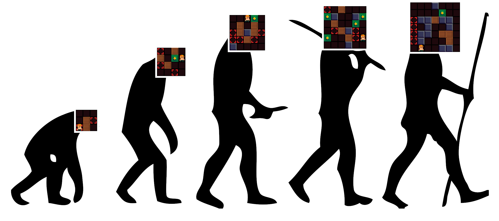
</p>

Original Image by [José-Manuel Benitos](https://commons.wikimedia.org/wiki/User:Locutus_Borg) ([CC BY-SA 3.0](https://creativecommons.org/licenses/by-sa/3.0/)).

<!-- omit in toc -->
## About

This repository contains the code for the paper ["Start Small: Training Controllable Game Level Generators without Training Data by Learning at Multiple Sizes"](https://doi.org/10.1016/j.aej.2023.04.019). It proposes a method to train level generators from nothing by starting at a small size. The method makes the following assumptions:
- The probability of finding playable levels via random exploration is sufficiently high at small level sizes.
- The generator can gain knowledge from learning at small sizes to start generating levels at larger sizes.

For the first assumption, we are yet to try a game that does not satisfy it. For Sokoban, the probability that a random 3x3 level is playable is ~0.6% which is sufficiently high for our method. The probability was even higher in the other games we tried. For the second assumption, the results show that it is true, since the generators learn to generate diverse levels for sizes they have not seen during training. Overall, the method presents the following advantages:
- Train the generator without reward shaping or training examples, so it should be easier to apply on new games.
- Learn to generate diverse playable levels at a variety of sizes within a relatively short amount of training time.
- Generate levels at sizes that were not seen during training (but the performance is usually better if the model was trained on the targeted size).
- Control the generator's output by supplying the desired properties as inputs to the model.

<!-- omit in toc -->
## Table of Content

- [Code Organization](#code-organization)
- [Method Structure](#method-structure)
- [Adding a new Game](#adding-a-new-game)
- [Installation](#installation)
- [Usage](#usage)
- [Pretrained Weights](#pretrained-weights)
- [Generated Level Samples](#generated-level-samples)
- [Citation](#citation)
- [License](#license)

## Code Organization

The repository is organized as follows:
- `cli.py`: which is the main entry point that can be used to invoke the different actions defined in the folder `actions`.
- `actions`: where the different actions, that `cli.py` can invoke, are implemented. The actions are organized into different files by their purpose (training, level generation, analysis, etc.).
- `common`: which contains some common utilities such as the configuration tools and the heatmap generator.
- `games`: which contains the implementations of the different games. The games are listed in a dictionary inside `games/__init__.py`.
- `methods`: which contains the implementations of the different methods (including the method proposed in the paper). Each method is defined in a separate subfolder.
- `datasets`: contains some dataset for some games. It is used by one of the methods, but not by the method proposed in the paper.
- `configs`: which contains the configurations for all the experiments and analyses for the different games and methods.
- `analyze.ps1`: which is a powershell script that runs all the analysis actions on an experiment.

## Method Structure

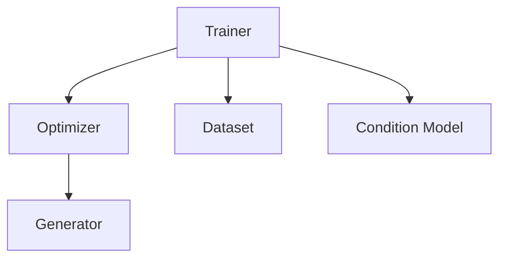

The main components are:
- `Generator`: which is the module that learns to generate the levels.
- `Optimizer`: which is responsible for optimizing the generator. Its interface depends on the method, so each optimizer can only be used with a compatible trainer and for a compatible generator.
- `Dataset`: where the levels are stored. It also differs depending on the method, so it can only be used by a compatible trainer. For some methods (such as the GFlowNet level generator), the dataset is initially empty and is filled over time. In that case, it acts as an experience replay buffer.
- `Condition Model`: which is used to sample conditions. The trainer should update it after it updates the dataset. Currently, the implemented condition models are trainer-agnostic and can be used with all the trainers available in this repository. 
- `Trainer`: which is the class that orchestrates the whole training process.

## Adding a new Game

Each game is defined using two classes:
- A `Game` class which defines the game tiles, sprite images and the game's functional requirements. The functional requirements should be defined in the function `analyze` which takes a list of levels and returns an information dictionary for each level that should at least contain the following:
  - `"level"`: which is the level itself (without any changes).
  - `"solvable"`: which is a boolean that indicates if the level can played and won or not.
- A `ConditionUtility` class which is used to retrieve some tools and values to be used with the controls (conditions). Look at the class documentation in `games/game.py` to know more about it.

## Installation

This repository requires `Python 3.9` and `Pytorch 1.11`. All the requirements are defined in [environment.yml](environment.yml).

you can either create a new environment from it using:

    conda env create -f environment.yml
    conda activate msgen

or update an existing environment using:

    conda env update --file environment.yml

**Note:** The dependencies install a package from a Github repo ([sokosolve](https://github.com/yahiaetman/sokosolve)) which is a Sokoban solver required to run the Sokoban experiments.

## Usage

To start a training session, you can use:

    python cli.py train -cfg ./configs/sokoban/gflownet/div-tuple.yml

This starts a training session for a Sokoban level generator using the GFlowNet method. It automatically creates a folder `runs/%TIME_%NAME` where `%TIME` is replaced by a timestamp containing the training start time and `%NAME` is replaced by a automatically created name that represents the experiment configuration. This folder will hold all the experiment results including a copy of the training configuration, the checkpoints and a tensorboard log. If you wish, you can override the save path as follows:

    python cli.py train -cfg ./configs/sokoban/gflownet/div-tuple.yml -ovr save_path="./experiment"

This will save the experiment results in the folder `./experiment`. You can also override other configuration options similarly. For example, we can turn off data augmentation using:

    python cli.py train -cfg ./configs/sokoban/gflownet/div-tuple.yml -ovr save_path="./experiment" dataset_config.data_augmentation:=False

The `:=` sign means that the value after it will be passed to the python built-in function `eval`, and it is useful to set options that are not strings. If the training was interrupted, you can resume it using:

    python cli.py resume ./experiment
 
This command will automatically read the correct configuration from the given path. After you finish the training process, it is still not ready to be used for generation. You have to build a condition model for it. In the paper, the condition model is a [Bayesian GMM](https://scikit-learn.org/stable/modules/generated/sklearn.mixture.BayesianGaussianMixture.html) fit to the final dataset checkpoint. To do that, you can use:

    python cli.py cmms ./experiment/checkpoints/dataset_%END_*x*.json ./experiment/condition_models/GMM -cfg configs/sokoban/ms_conditions/gmm.yml

Notice that we use a glob pattern to supply the final datasets for all the sizes. The script automatically replaces `%END` with the number of training steps at the last checkpoint. After that you can use the generator and the condition model to generate a batch of levels as follows:

    python cli.py genms ./experiment/checkpoints/model_%END.pt ./experiment/condition_models/GMM ./experiment/output -cfg configs/sokoban/analysis/generate.yml

The level count and sizes are defined in the config file [configs/sokoban/analysis/generate.yml](configs/sokoban/analysis/generate.yml). You can override any of these configurations using `-ovr` or by writing another config file. After generating the files, you may want to collect some statistics about the generated levels. For that you can use:

    python cli.py statsms ./experiment/output/levels_*x*.json ./experiment/statistics/statistics.yml -cfg configs/sokoban/analysis/statistics.yml

There are still more scripts, so it would become tedious to repeat them after every experiment. So after the training is done, you can do all the analysis steps (including the condition model and level generation) using the [analyze.ps1](analyze.ps1) powershell script which will save the analysis results in the given experiment folder. To run this script, use the following:

    ./analyze.ps1 sokoban ./experiment

Note that this script requires the game name to pick some options. If you want to run all the experiments in the paper (including the analysis steps), you can just run [paper_experiments.ps1](paper_experiments.ps1) but note that it runs 30 experiments so it would probably require multiple days to finish depending on your machine.

To explore the results of the generators by hand, you can run them, and try different control values and level sizes in the Jupyter notebook [explore.ipynb](explore.ipynb).

## Pretrained Weights

You can download weights for the generators and the condition models from [here](https://drive.google.com/file/d/1BOfuYo4BFuJeyIG57d-AQ6q5D9nRUJUz/view?usp=sharing). It only contains the files necessary to run the generators to save space.

## Generated Level Samples

The following samples have been randomly picked from the playable portion of the generated levels.

---

<h1 align="center">
Sokoban
</h1>
<p align="center">
  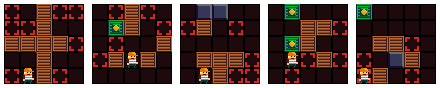
  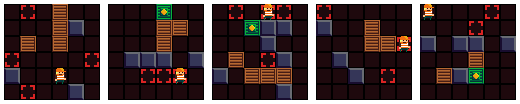
  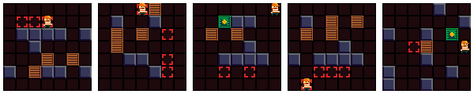
</p>

---

<h1 align="center">
Zelda
</h1>
<p align="center">
  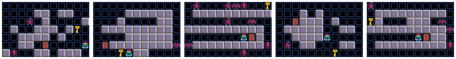
  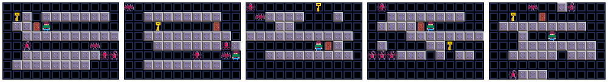
  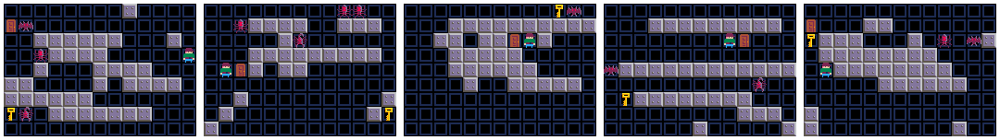
</p>

---

<h1 align="center">
Danger Dave
</h1>
<p align="center">
  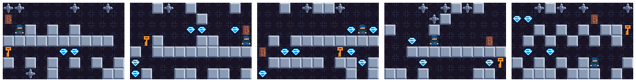
  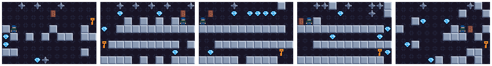
  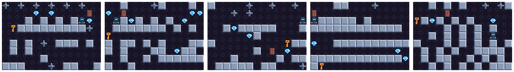
</p>

## Citation

If you find this work useful, please consider citing it:

```
@misc{msgen,
  author   = {Yahia Zakaria and Magda Fayek and Mayada Hadhoud},
  journal  = {Alexandria Engineering Journal},
  title    = {Start small: Training controllable game level generators without training data by learning at multiple sizes},
  year     = {2023},
  issn     = {1110-0168},
  pages    = {479-494},
  volume   = {72},
  doi      = {https://doi.org/10.1016/j.aej.2023.04.019},
  keywords = {Procedural content generation, Level generation, Deep learning, Generative flow networks, Generative models},
  url      = {https://www.sciencedirect.com/science/article/pii/S1110016823002934},
}
```

## License

The project is available as open source under the terms of the [MIT License](LICENSE).